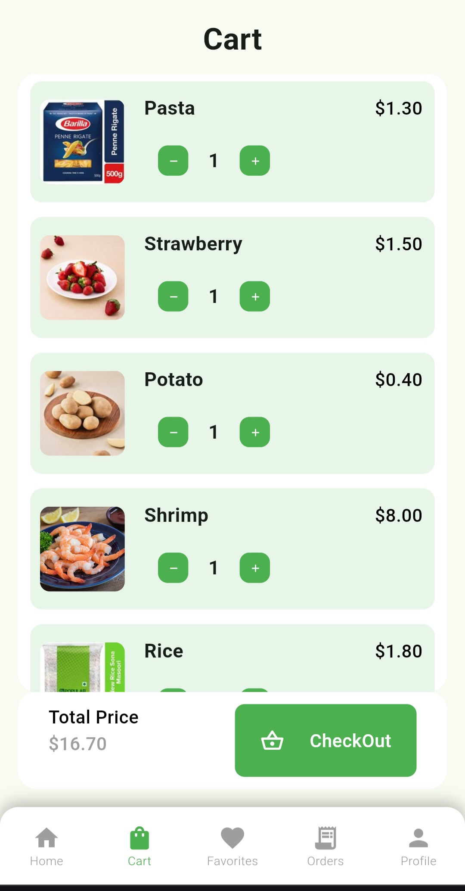
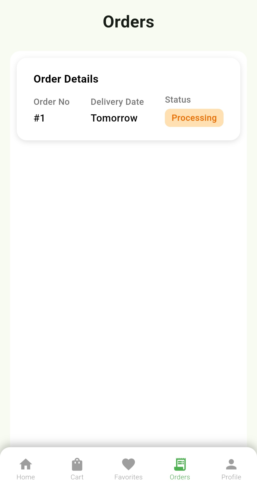

# 🛒 Flutter E-Commerce App (UI + Local Logic)

A basic yet fully functional Flutter e-commerce app that uses local data structures (lists) to dynamically generate all product pages. Includes core features like favorites, cart, and order placement — all without requiring login or backend integration.

---

## 📱 Screenshots


<p align="center">
  
  
  
  </p>
  <p align="center">
  
  
  
</p>

---

## ✨ Features

- 🏠 Home page with product list (`home_page.dart`)
- 🔍 Product details page (`details.dart`)
- 🧺 Cart functionality with quantity update and remove (`Cart.dart`)
- ❤️ Add/remove from favorites (`Fav.dart`)
- 📦 Order confirmation page (`Order.dart`)
- 👤 Profile placeholder screen (`Prof.dart`)
- 🧭 Bottom navigation bar (`navbar.dart`)
- 📱 Fully responsive UI
- 🔄 Dynamic rendering from hardcoded product list

---

## 🚀 Tech Stack

- **Flutter** (Dart)
- Stateless & Stateful widgets
- Local data list to mimic product catalog
- No Firebase or backend services
- No login/signup — app focuses on UI + local state logic

---

## 🛠️ Getting Started

1. **Clone the repo**
   ```bash
   git clone https://github.com/FadilCN/Flutter-Ecommerce-App.git
   cd Flutter-Ecommerce-App
   ```

2. **Install packages**
   ```bash
   flutter pub get
   ```

3. **Run the app**
   ```bash
   flutter run
   ```

> Ensure Flutter SDK is installed and connected to a device/emulator.

---

## 📁 Folder Structure

```
lib/
├── main.dart
├── home_page.dart
├── details.dart
├── Cart.dart
├── Fav.dart
├── Order.dart
├── Prof.dart
├── navbar.dart
└── util/
```

---

## 📄 License

This project is open-source and free to use. You can add your own license if needed.

---

## 🙌 Acknowledgements

Made with ❤️ by [@FadilCN](https://github.com/FadilCN)
